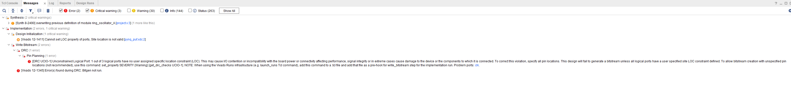

# Phase II Update

## Integration Progress
Step 1: Create a Vivado Project

Choose RTL Project and tick "Do not specify sources at this time". In the Default Part, search for the PYNQ-Z1 FPGA: Select "xc7z020clg400-1"

Step 2: Add RTL Sources

In the Sources pane, right-click and add the Verilog file. If there is a testbench (for simulation), then add it too, but for hardware programming, it's not required.

Step 3: Add Constraints (XDC)

Now have to assign pins to design inputs/outputs. The PYNQ-Z1 board uses specific FPGA pins connected to PMODs, LEDs, switches, etc. Add a constraints file (.xdc) to the project. Use the PYNQ-Z1 Master XDC file from Digilent. Uncomment and modify only the pins that will be used in the design.

Step 4: Synthesize and Implement

Click Run Synthesis. After that, Run the Implementation.

Step 5: Generate Bitstream

Once implementation is complete, click Generate Bitstream. 

Step 6: Program the PYNQ-Z1

Have to make sure the board is: i) Powered on. ii) Connected to PC via USB-JTAG. In Vivado, go to Open Hardware Manager > Open Target > Auto Connect. Once connected, click Program Device. Select the bitstream file (.bit) and program it. 

## Issues and Challenges
After generating the bitstream, several errors were encountered, most of which were resolved. However, a DRC (Design Rule Check) issue related to the clock pin remains unresolved. Efforts were made to address the problem by modifying the XDC file, but the issue persists. As a result, the hardware could not be programmed onto the PYNQ-Z1 FPGA board. Work is currently ongoing to troubleshoot and resolve this issue.

Fig. 1. Vivado DRC Error
