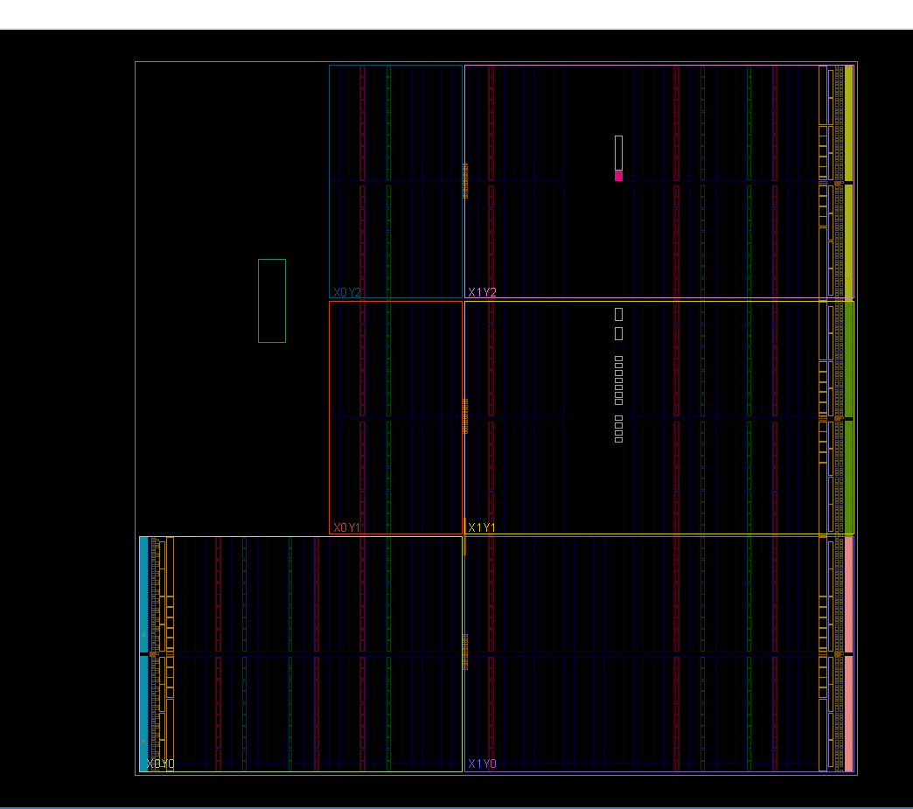
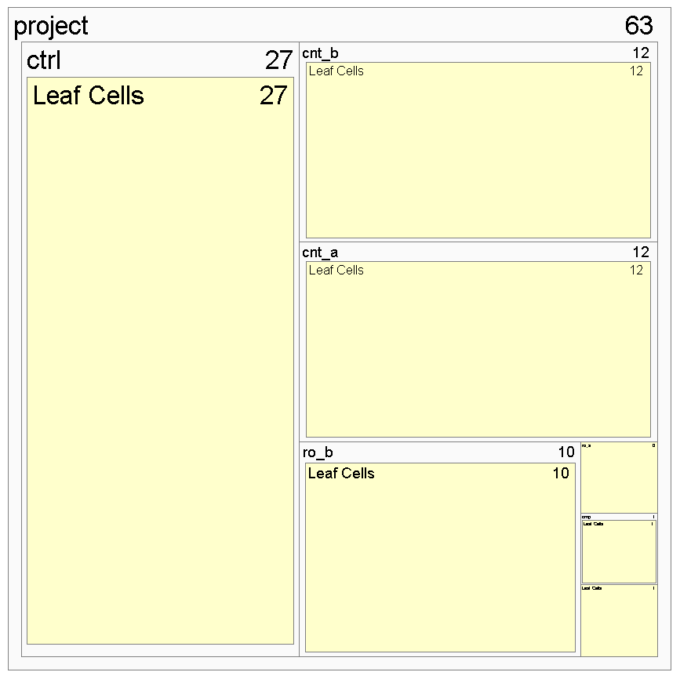

# Project_Template

## Team Name: 
Crypto_Ringmasters

## Team Members:
- Shafat Shahnewaz
- Rumali Siddiqua
  
## Project Title:
 Implementation and Analysis of Ring Oscillator-based PUF on Xilinx PYNQ-Z1.

## Project Description:
This project focuses on the design and implementation of a Physically Unclonable Function (PUF) based on Ring Oscillator (RO) architectures, deployed on two FPGA platforms within the Xilinx PYNQ-Z1 board. PUFs are lightweight hardware security primitives that leverage inherent manufacturing variations in silicon to produce unique and unpredictable device identifiers. These identifiers can be used in secure applications such as cryptographic key generation, device authentication, and tamper detection.

## Key Objectives:
- Design and implement a RO-PUF architecture using Verilog on 3 PYNQ-Z1 boards.

- Analyze and compare entropy, stability, and uniqueness across different platforms.

- Evaluate power, area, and timing efficiency for integration into secure embedded applications.

## Technology Stack:
## Hardware:

- Xilinx PYNQ-Z1

## Software Tools:

- Vivado (for Xilinx FPGA design)

- ModelSim (simulation)

- Python/NumPy for data analysis

## Languages:

- Verilog (PUF logic)

- Python (data collection and control on PYNQ)

## Expected Outcomes:
- Functional RO-PUF design on both platforms
- Entropy and reliability analysis of PUF responses
- Resource and performance comparison between PYNQ and Intel platforms
- Prototype for secure key generation in embedded devices

## Tasks:

| Task               | Description                                                              
|--------------------|-------------------------------------------------------------------
| Literature Survey  | Review RO-PUF implementations and related security techniques             
| Verilog Design     | Implement RO, controller, comparator, and shift register modules          
| PYNQ Integration   | Develop AXI-Lite interface and Jupyter Notebook interface                 
| Testing & Analysis | Measure frequency and stability across devices                  
| Documentation      | Prepare final report and presentation                                  

## Timeline:

| Milestone                          | Timeline     |
|-----------------------------------|--------------|
| Literature review and design planning | Week 0       |
| Implementation on PYNQ-Z1         | Week 1        |
| Implementation on Intel FPGA      | Weeks 2–3     |
| Testing and environmental analysis| Weeks 2–3     |
| Data analysis and documentation   | Week 4        |
| Final report and presentation     | Week 4        |

## Workflow of the Project:

This project involves the design, simulation, and FPGA deployment of a 1-bit RO-PUF (Ring Oscillator-based Physical Unclonable Function). The objective is to demonstrate a lightweight hardware security primitive on reconfigurable platforms.

Step 1: Behavioral Simulation

- Simulated the Verilog design using Vivado Simulator and GTKwave for functional verification.

- Verified the toggling behavior of ROs, counting accuracy, and correct comparator output.

- Observed output bit changes based on small frequency differences between ROs.

Fig. 1. Behavioral RTL Simulation 

 
 

Step 2: FPGA Implementation on PYNQ-Z1

2.1 Vivado Project Setup

- Created an RTL project in Vivado using the target part: xc7z020clg400-1

- Added Verilog source files and optionally the testbench for simulation.

p align="middle">

Fig. 2. Vivado RTL Source View Pane

2.2 Constraints File (XDC)

- Used Digilent's Master XDC for PYNQ-Z1.

2.3 Synthesis & Implementation

- Ran synthesis and implementation processes in Vivado.

- Ensured timing closure and no critical warnings.

p align="middle">

Fig. 3. Schematic View

p align="middle">

Fig. 4. Floorplanning View

p align="middle">

Fig. 5. Hierarchy Level of RTL Module

p align="middle">

Fig. 6. IO Planning

2.4 Bitstream Generation

- Generated .bit file after successful implementation.

2.5 Board Programming & Demo

- Connected the PYNQ-Z1 board via USB-JTAG.

- Programmed the FPGA using Vivado Hardware Manager.

- Observed the PUF bit (0/1) via onboard LEDs.

- Tested on three different PYNQ-Z1 boards for uniqueness and reproducibility.
